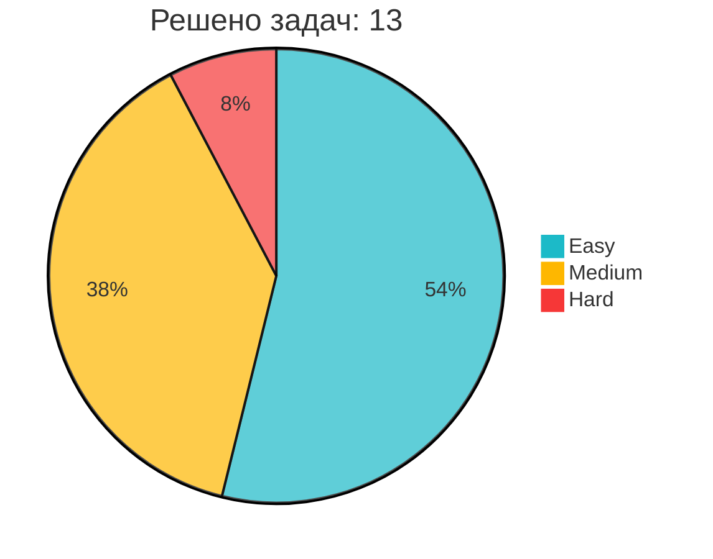

# Привет! Я Курдюков Илья 👋

## 👨‍💻 Обо мне
- Дата аналитик/Продуктовый аналитик 
- Опыт работы с 2023 года
- Закончил ТГУ по направлению "Прикладная информатика"  
- Ищу работу аналитиком данных/продуктовым аналитиком 

## 🛠️ Технологии и инструменты

### 📊 Анализ данных

### 📈 Машинное обучение  
  
  

### 📊 BI и Визуализация  
  
  

### 📈 A/B-тестирование

### 🧮 Базы данных

### 🛠️ Инструменты

## 📊 GitHub статистика
  
  

## 🏆 LeetCode статистика  
<!-- LEETCODE_STATS -->

**Ранг**: 4 480 950 

*Обновлено: 07.08.2025 21:09*
<!-- LEETCODE_STATS_END -->

## 📫 Контакты 
- Telegram: [@ilia_kurdukov](https://t.me/ilia_kurdukov)  
- Почта: 79817899982@ya.ru
